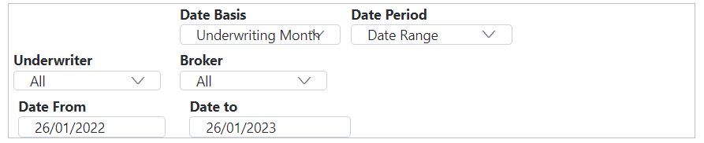

# Dashboard

The Dashboard provides a visual aggregation of different data vectors from the system.

## Filters

The filters section allows you to narrow down and view data based on multiple specific points. Note that filters are not Independent but are linked and overlapping, i.e. the graphs will show the cross section of the data based on **all** the filters.

**Filters are:**

### Date Basis
Underwriting Month is the month in which the policy incepts. Booked Month is the month in which a premium is posted. 

i.e. policy incepts in April 2022 - Initial premium £5,000 posted April 2022, Additional Premium £1,000 processed in August 2022. 

Premium by uw month April 2022 - £6,000, 

Premium by Booked Month April 22 - £5,000, August 22 - £1,000.

### Date Period

The options are:

- **YTD** - October 1st -October 1st
- **QTD** - Quarter to date(financial)
- **MTD** - Month to date
- **Date** Range - Specify a range of dates, will default to current date minus one year. Selecting this option will bring up two new Date Inputs below

### Underwriter

Filter by Underwriter, this is a drop-down list of all the users in an agency that have the underwriter permission.

### Broker

Filter by Broker, this is a drop-down list of all the brokers for an agency.

