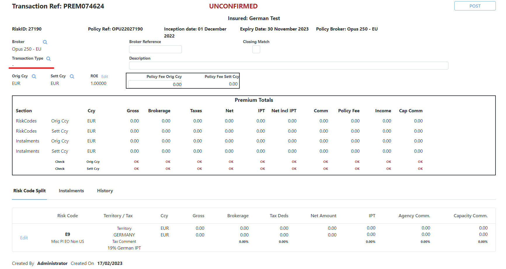
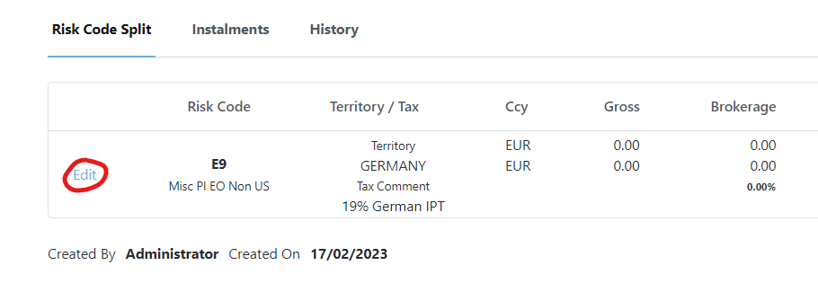
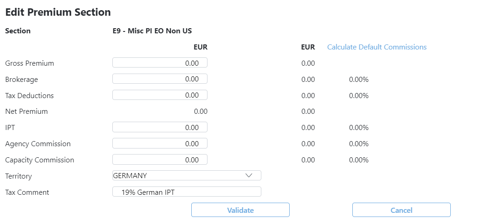
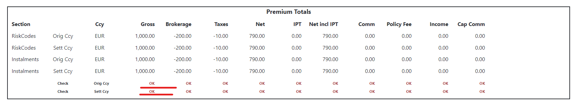

To add a premium transaction, the risk must be ready to post, [see previous guide](/risk/riskdetails)

#### 1. Navigate to the premiums tab at the bottom of the risk screen and click the **Add Premium** button
#### 2. You should see a screen like the one below. First you will need to enter a transaction type.

#### 3. Make sure the set your Original and settlement currencies. They will both be defaulted to the risk currency.
#### 4. At the bottom, click edit on the **Risk Code Split** tab

#### 5. Enter the premium details allong with any Tax or IPT values, press validate and the save.

#### 6. Next go to the Instalments tab, here we can auto generate instalments based on the Account Freq or we can add them manually

- Monthly
- Quarterly
- Half Yearly
- Yearly

Select the option that applies best to the risk and hit generate. You may need to change the dates on the generated instalments to match with the risk.

#### 7. If everything has been done correctly you should see a series of "Ok" as shown below. If not and your figures dont match up, check that your instalments add up to the risk code premium entered.

#### 8. Once done you can Hit **POST** and this will post the premium and create a ledger entry. 