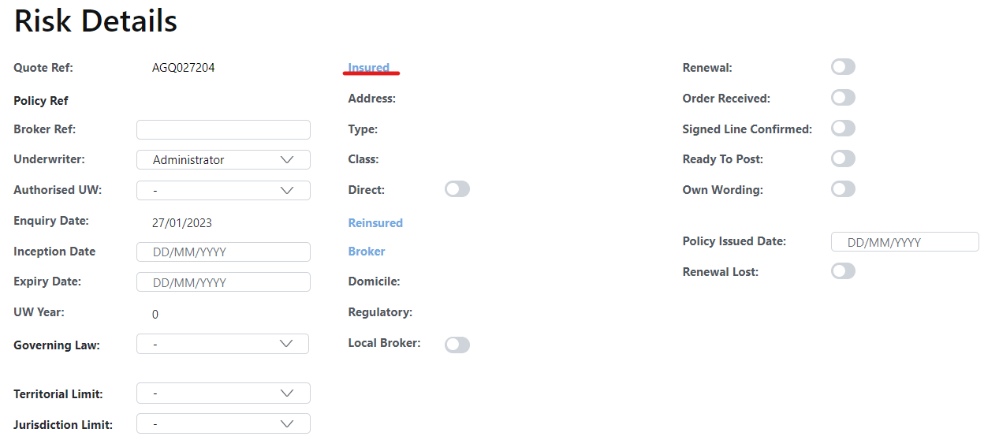
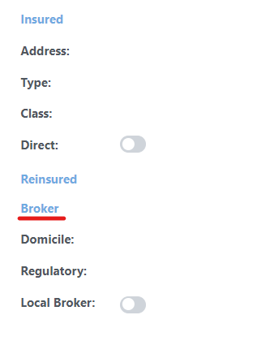
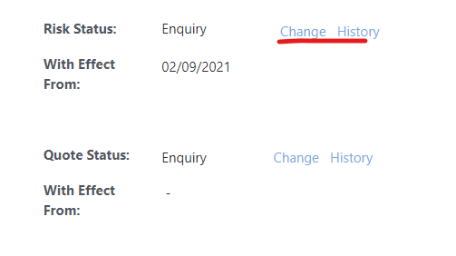

Adding a risk **quickstart** guide

#### 1. Add an insured by clicking the blue insured button

#### 2. Select an existing insured or add a new one using the form
#### 3. Add the broker by clicking the blue broker button, this works the same as the insured. You may need to get management to add the broker if it is not on the list due to KYC requirements.

#### 4. Add an inception and Expiry date
#### 5. Check the **Order Received** button and give it a date
#### 6. Check Ready to post - This will pop up with an error if there are any agency specifics fields that need to be completed.
#### 7. Change the risk status to Live

#### 8. Create and post a premium
